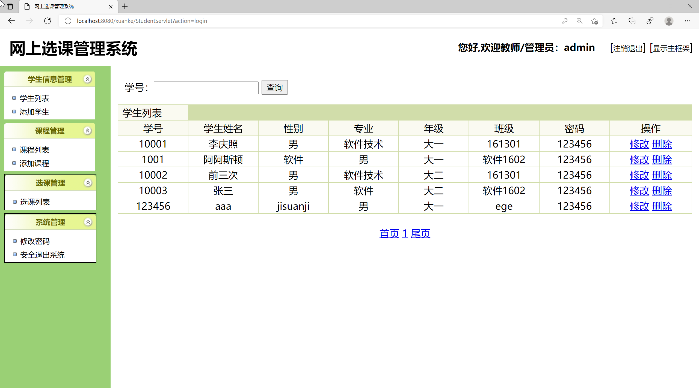
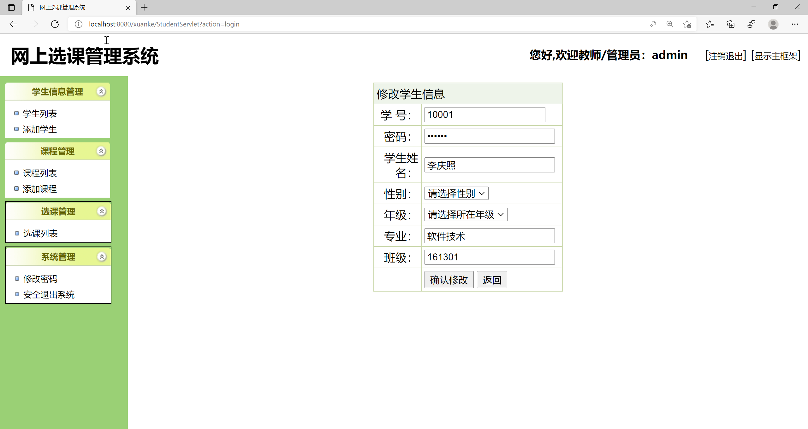
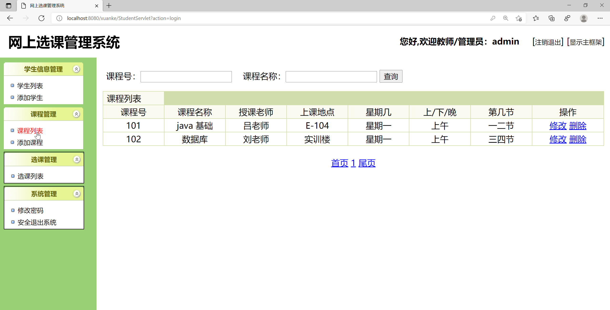
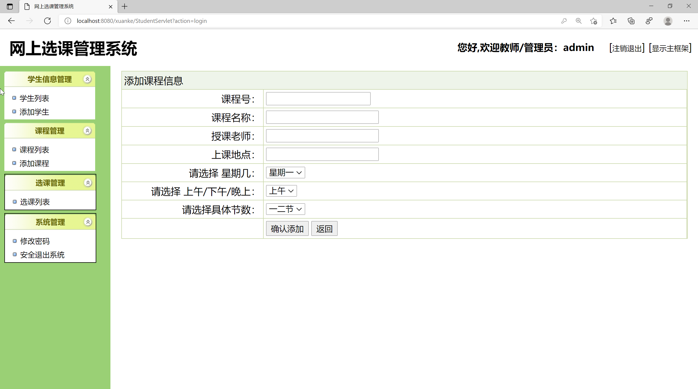
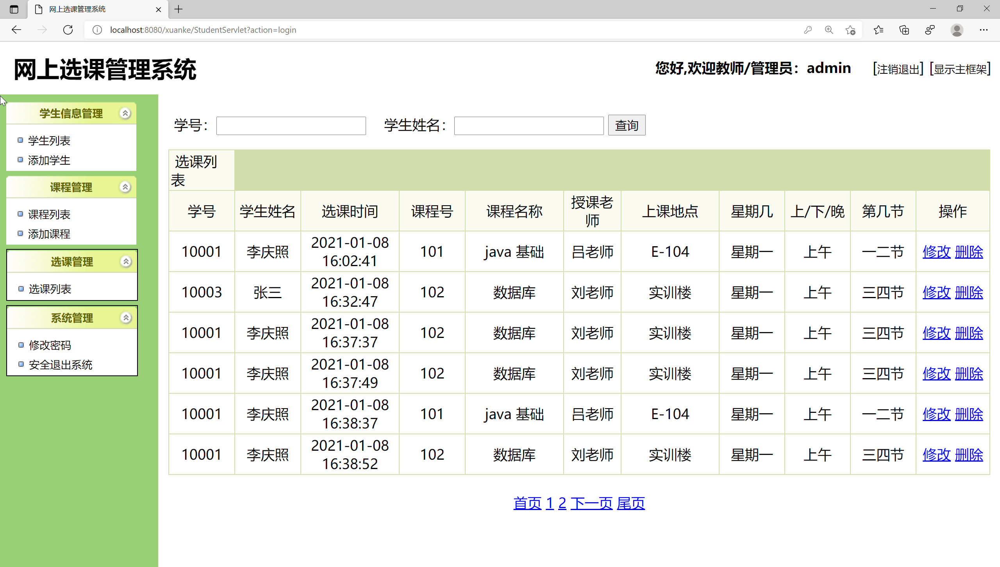
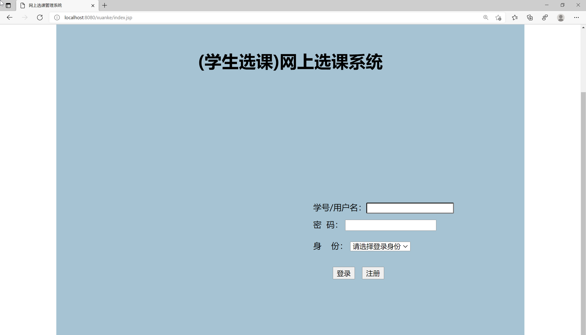
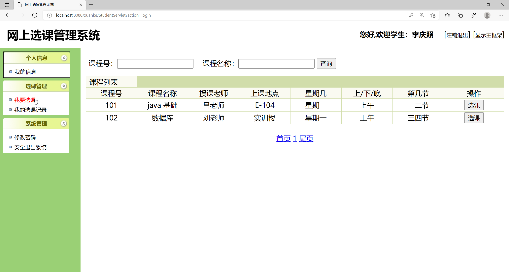

<h1 align="center">基于JSP+Servlet实现的网上选课系统</h1>

<h4> 完整代码获取地址：从戎源码网（https://armycodes.com/） </h4>
<h4> 作者微信：19941326836 QQ：605739993 QQ群：655392706 </h4>
<h4> 承接计算机毕设、Java毕业设计、Python毕业设计、深度学习、机器学习 </h4>
<h4> 选题+开题报告+任务书+程序定制+安装调试+论文+答辩ppt 一条龙服务 </h4>
<h4> 毕业设计所有选题地址：(https://github.com/Descartes007/allProject) </h4>

## 项目介绍

基于JSP+Servlet实现的网上选课系统：前端 JSP、BootStrap、JQuery、Ajax，后端 Servlet、JDBC，系统角色分为：管理员、教师和学生。管理员在管理端管理用户信息，发布课程等；老师可以查看选课情况，筛选选课学生等；学生可以查看课程信息并选课等。主要功能如下：

### 管理员

- 基本操作：登录、注册、修改密码、退出系统
- 学生信息管理：获取学生信息列表、查看学生信息详情、修改学生信息、删除学生信息、筛选学生信息、添加学生
- 课程管理：获取课程信息列表、查看课程信息详情、修改课程信息、删除课程信息、筛选课程信息、添加课程
- 选课管理：获取选课信息列表、查看选课信息详情、修改选课信息、删除选课信息、筛选选课信息

### 教师

- 基本操作：登录、注册、修改密码、退出系统
- 学生信息管理：获取学生信息列表、查看学生信息详情、修改学生信息、删除学生信息、筛选学生信息、添加学生
- 课程管理：获取课程信息列表、查看课程信息详情、修改课程信息、删除课程信息、筛选课程信息、添加课程
- 选课管理：获取选课信息列表、查看选课信息详情、修改选课信息、删除选课信息、筛选选课信息

### 学生

- 基本操作：登录、注册、修改密码、退出系统、修改个人信息
- 选课管理：获取选课信息列表、查看选课信息详情、筛选选课信息、选课

## 环境

- <b>IntelliJ IDEA 2020.3</b>

- <b>Mysql 5.7.26</b>

- <b>Tomcat 9.0.41</b>

- <b>JDK 1.8</b>

## 运行截图

